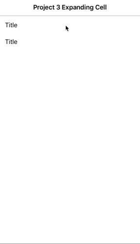
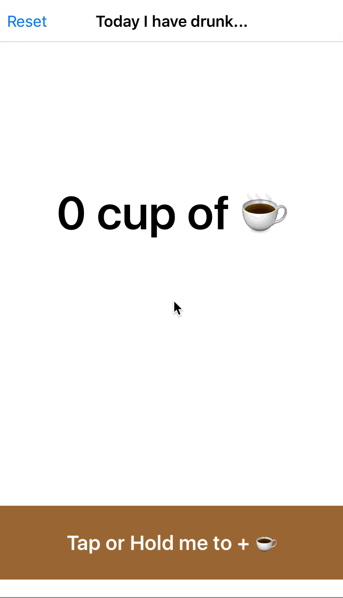

# 100DaysofSwift
Learn new launguge and Callege myself.

-------------------------

I learned how to:
* Observe values changed
* Custom displayCell

Tool: XCode 7, Swift 2.2

-------------------------

I learned how to:
* Long press gesture
* if statement
* Alert view

Tool: XCode 7, Swift 2.1

---------------------------

I learned how to:
* Build without storyboard
* Use function with button

Tool: XCode 7, Swift 2.1
